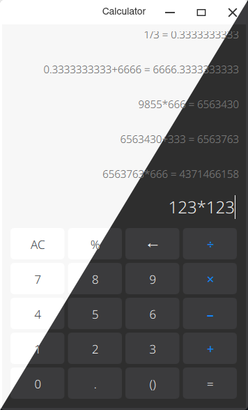

# Calculator

CutefishOS Calculator



## Dependencies

On ArchLinux:

```shell
sudo apt-get install cmake gcc qtbase5-dev qtdeclarative5-dev qml-module-qtquick2 qml-module-qtquick-controls2
```

## Build and Install

```
mkdir build
cd build
cmake ..
make
sudo make install
```

## License

This project has been licensed by GPLv3.